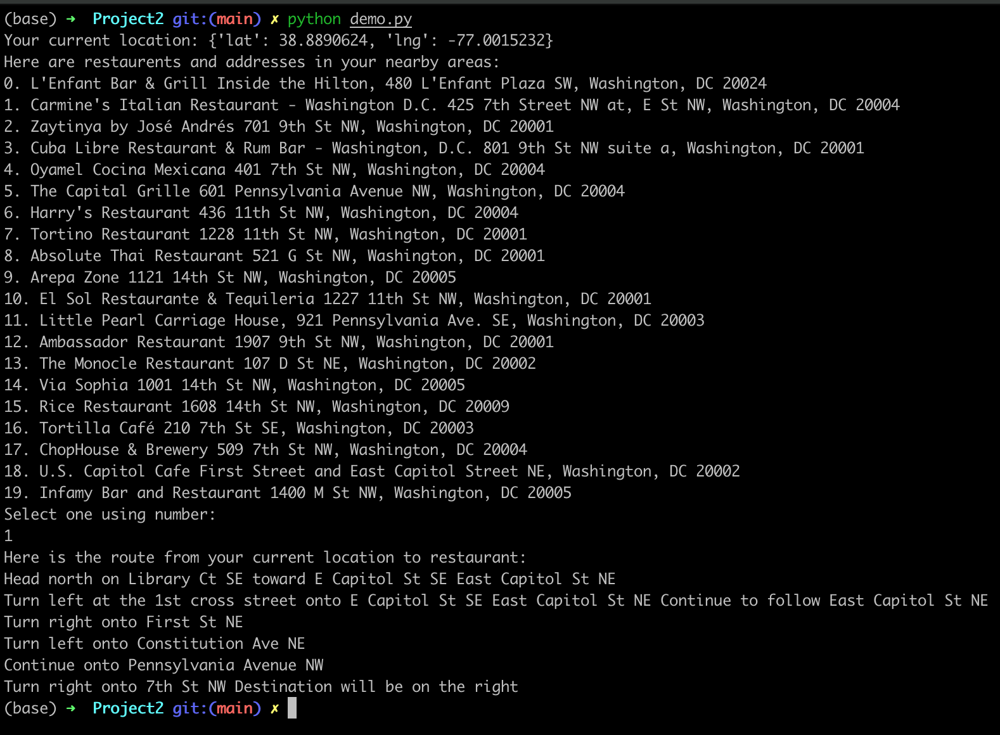

# Project 2: Restaurant Guider Using Google Map APIs 


## Product Mission

This product aims to provide users a resturant guider, which enables users to get the restaurants in the nearby area based location services and choose a restaurant. After users choose a restaurnt, the product will provide routes from user's current location to the restaurant.


## User Stories

As a user, I want to know restaurants in my nearby areas. 

As a user, I want to select a restaurant in the given recommendation list.

As a user, I want to get the route from my current location to a restaurant.


## MVP

The MVP should have the following functions:  
1. Get user's current location and obtain the restaurants nearby using Goole Map APIs
2. User can select the nearby restaurents. 
3. Return the user with route from user's current location to the restaurants.


## Demo

```
pip install -U googlemaps
python demo.py
```

Result:




